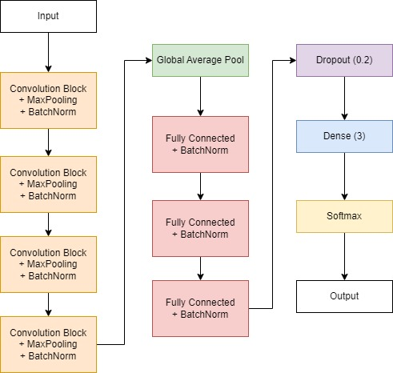

# CNN Brain Tumor Detection
## **Overview**
Brain tumor is a disease characterized by abnormal cell growth in brain tissue. One of the ways that doctors can detect brain tumors is direct observation with manual diagnosis which has a risk of error. The development of artificial intelligence on computer vision has now been applied in image classification in the health sector. Based on this case, we are building a classification system using Convolutional Neural Networks to address the disease problem.

## **Architecture CNN**
Architecture of CNN Model for brain tumor classification problem.


## **Installation**

1.  Clone this repository to your local device using `git`:
    ```
    https://github.com/FariskaRatna/brain-tumor-detection-cnn.git
    ```
2.  Change your terminal into the new subdirectory:
    ```
    cd brain-tumor-detection-cnn
    ```
3.  Then open in Visual Studio Code:
    ```
    code .
    ```
4.  If the Python requires a virtual environment, create and activate the virtual environment in the terminal
    ```
    python -m venv venv
    .\venv\Scripts\activate
    ```
5.  Install project depedencies using:
    ```
    pip install -r requirements.txt

## Streamlit
You can access the tumor classification using streamlit [here](https://brain-tumor-detection-cnn-f2ssv6c85htz8feizqyzat.streamlit.app/).